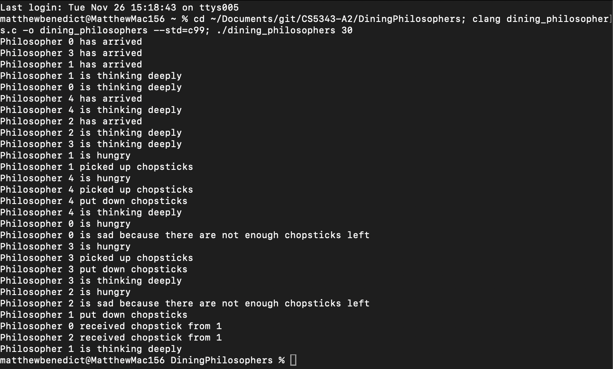
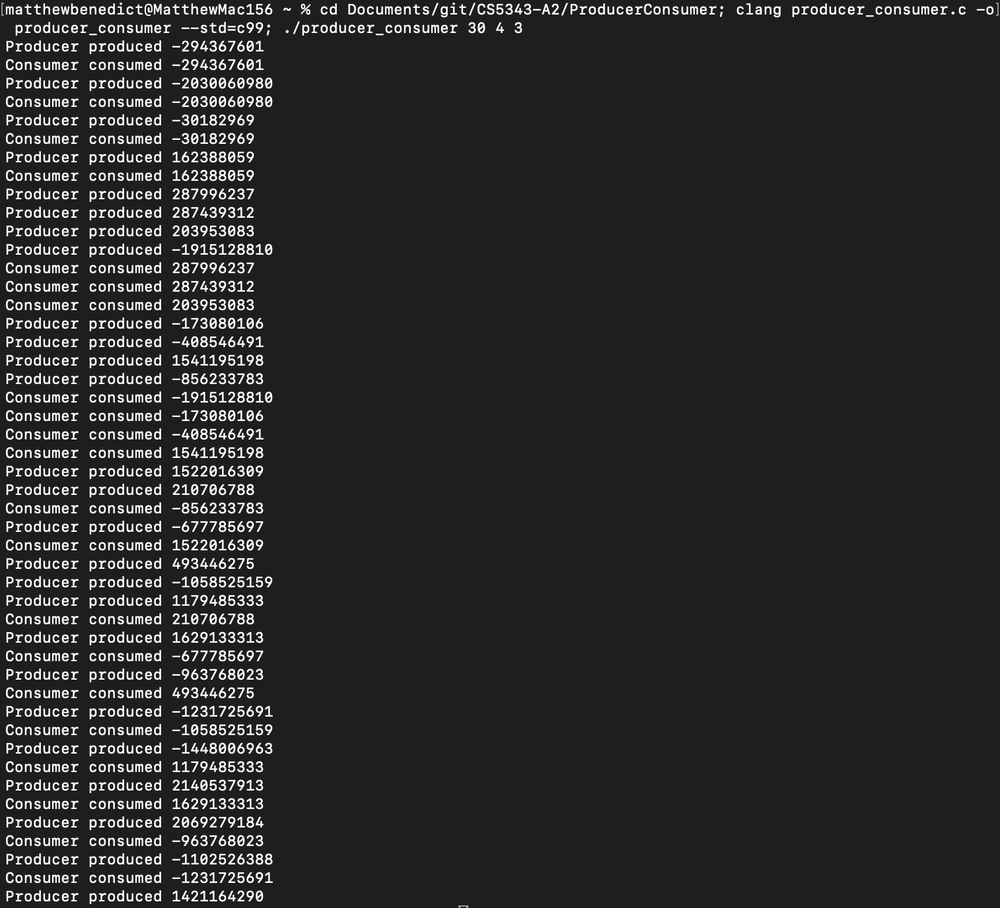

In this assignment, I implement solutions to the dining philosophers and producer-consumer problems in C using POSIX-conformant APIs.

## Dining Philosophers

The dining philosophers program can be compiled by `clang dining_philosophers.c -o dining_philosophers --std=c99`. The program takes one argument, the number of seconds for which to execute before terminating, e.g. `./dining_philosophers 30`.

## Producer-Consumer

The producer-consumer program can be compiled by `clang producer_consumer.c -o producer_consumer --std=c99`. The program takes three arguments: the number of seconds for which to execute before terminating, the number of producer threads, and the number of consumer threads, e.g. `./producer_consumer 30 4 3`

